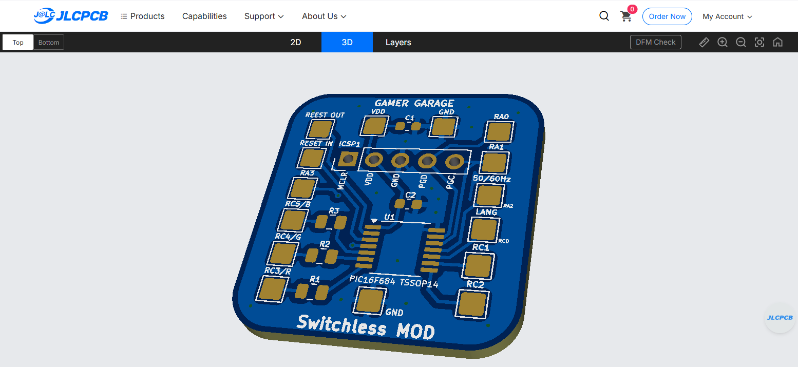
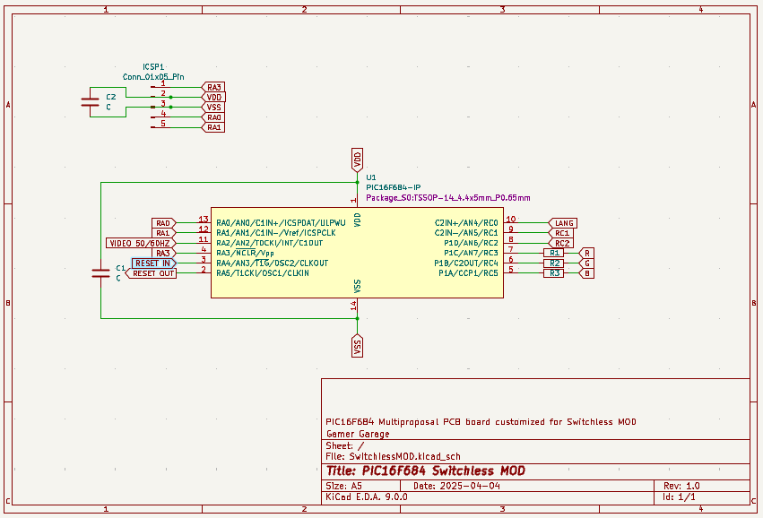

# Sega Mega Drive - PIC16F684 Switchless Region & Reset Mod

Este proyecto contiene el firmware en C para un microcontrolador PIC16F684 diseñado específicamente para realizar un mod "switchless" (sin interruptores físicos) en la **Sega Mega Drive** (o Genesis). 

Permite controlar el reinicio y cambiar la región (PAL/JAP/USA) de la consola utilizando únicamente el botón de RESET original. Además, utiliza un LED RGB para indicar visualmente en qué región se encuentra el sistema en cada momento.

## 🚀 Características

* **Control con un solo botón:** Discrimina entre pulsaciones cortas (reinicio) y pulsaciones largas (cambio de región) usando el botón de RESET original de la Mega Drive.
* **Memoria EEPROM:** Guarda la última región seleccionada para que la consola arranque con ella la próxima vez que se encienda.
* **Indicador LED RGB:** Muestra visualmente la región actual (Rojo = PAL, Verde = JAP, Azul = USA). Sustituye al LED rojo original de la consola.
* **Antirrebote por software:** Evita falsas pulsaciones y reinicios accidentales.

## 🧩 Circuito Impreso (PCB) Personalizado y Gerbers

Para facilitar la instalación y hacerla lo más limpia posible, he diseñado una placa de circuito impreso (PCB) a medida para este mod.

### Vista de la PCB

### Esquemático (KiCad)

* **Descarga de Gerbers:** Puedes descargar los archivos **Gerber** incluidos en este repositorio para pedir tus propias placas en fabricantes de PCBs como JLCPCB, PCBWay, o el servicio que prefieras.
* **Instalación de Resistencias:** Si utilizas mi diseño de PCB para el mod, recuerda que las resistencias limitadoras para los tres colores del LED RGB deben ir soldadas exactamente en las posiciones marcadas como **R1, R2 y R3** en la serigrafía de la placa.
* **Uso Multipropósito (Breakout Board):** El diseño de la placa es genérico. El orden de los pads de conexión exteriores respeta exactamente el pinout físico del PIC16F684. Si puenteas (haces un corto con estaño) las posiciones de las resistencias R1, R2 y R3, puedes usar esta PCB como un adaptador genérico para cualquier otro proyecto que utilice este microcontrolador.
* **Puerto de Programación (ICSP):** La placa incluye pines para un puerto ICSP (In-Circuit Serial Programming). Esto te permite programar y actualizar el firmware del PIC directamente sobre la propia PCB, sin necesidad de extraer el chip.

## ⚙️ Funcionamiento

El comportamiento del botón (conectado a `RA4`) es el siguiente:

1.  **Pulsación Corta (menos de 2 segundos):** * Envía una señal de reinicio (LOW) a la consola durante 200ms. Funciona como un botón de reset tradicional.
2.  **Pulsación Larga (más de 2 segundos):** * Entra en el "Modo de Selección". 
    * El LED RGB empezará a ciclar entre los tres colores/regiones cada 500 milisegundos.
    * Para seleccionar una región, simplemente suelta el botón cuando el LED muestre el color deseado. La selección se guarda automáticamente en la EEPROM.

### Zonas y Colores
| Región | Video | Idioma | Color LED RGB |
| :--- | :--- | :--- | :--- |
| **PAL (Europa)** | 50Hz (0) | Inglés (1) | 🔴 Rojo |
| **JAP (Japón)** | 60Hz (1) | Japonés (0) | 🟢 Verde |
| **USA (América)**| 60Hz (1) | Inglés (1) | 🔵 Azul |

## 🔌 Esquema de Conexiones (Pinout del PIC)

Si decides hacer la instalación sin mi PCB (en placa perforada o al aire), asegúrate de cablear el PIC16F684 respetando los siguientes pines:

| Pin Físico PIC | Nombre en Código | Función | Conexión a hardware de la Mega Drive |
| :---: | :--- | :--- | :--- |
| **3** | `RA4` | `RESET_IN` | Al botón físico de Reset (a GND al pulsar). Pull-up interno habilitado. |
| **2** | `RA5` | `RESET_OUT` | Al punto de Reset de la placa base. |
| **10** | `RC0` | `LANGUAGE` | Al jumper/pin de configuración de Idioma. |
| **11** | `RA2` | `VIDEO` | Al jumper/pin de configuración de Frecuencia (50/60Hz). |
| **7** | `RC3` | `LED_RED` | Al ánodo del LED Rojo (con su resistencia limitadora). |
| **6** | `RC4` | `LED_GREEN`| Al ánodo del LED Verde (con su resistencia limitadora). |
| **5** | `RC5` | `LED_BLUE` | Al ánodo del LED Azul (con su resistencia limitadora). |
| **1** | `VDD` | Alimentación | +5V de la consola. |
| **14** | `VSS` | Tierra | GND de la consola. |

*Nota: Los pines del LED asumen un LED RGB de cátodo común.*

## 🛠️ Compilación y Programación

Este proyecto está escrito en C y preparado para ser compilado con la suite de herramientas de Microchip:
* **IDE:** MPLAB X IDE
* **Compilador:** XC8 Compiler
* **Frecuencia del Oscilador:** 4MHz (Oscilador Interno configurado por `#pragma`)

Para flashear el firmware (`.hex`) en el microcontrolador, he utilizado el programador **PICkit 3**. Gracias al puerto ICSP de la placa, puedes conectar el PICkit 3 directamente alineando el pin 1 (MCLR) y programarlo en segundos.

## ⚠️ Advertencia
Modificar hardware original de consolas retro conlleva riesgos. Asegúrate de tener conocimientos de soldadura y revisar bien los puntos de corte y empalme de tu revisión específica de placa base (VA0, VA4, VA6, etc.) antes de proceder. No me hago responsable por daños ocasionados a tu Mega Drive/Genesis.

---

## 👨‍💻 Autor y Contacto

Creado por **Javi** de **GAMER GARAGE**. 

Si te ha resultado útil este mod o quieres ver más proyectos de reparación, modificación y electrónica, pásate por mi web:
🌐 **[www.gamergarage.es](https://www.gamergarage.es)**
